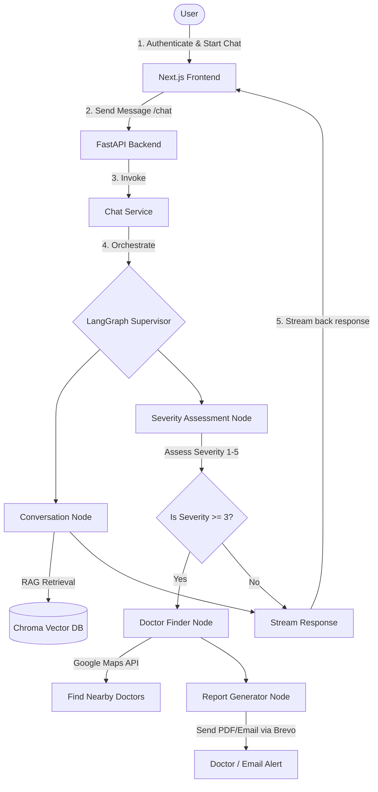

# 🩺 Anovaidya - Medical Trauma Assistant
### *Project Specification & Architecture Document*

---

> [!NOTE]
> **Metadata & Scope**
> - **Version:** 1.0
> - **Date:** May 2026
> - **Core Goal:** Build a production-grade, multi-agent AI Trauma Assistant using completely free/low-cost tools.

---

## 📋 1. Project Overview

**Anovaidya** is an intelligent conversational AI system designed to act as a first responder for trauma and injury cases. The assistant aims to calm the user, assess the injury severity in real-time, provide instant first-aid guidance using Retrieval-Augmented Generation (RAG) based on trusted medical manuals, and seamlessly escalate serious cases by locating nearby doctors/hospitals and sending structured patient reports.

---

## ✨ 2. Core Features

- 🔐 **User Authentication & Chat History** — Secure sign-up/login with persistent, structured chat histories.
- 💬 **Natural Sympathy & Conversation** — Compassionate, context-aware dialogues to guide users in high-stress trauma situations.
- 📊 **Intelligent Severity Assessment** — Dynamic assessment scoring (1 to 5 scale) combining LLM reasoning with rule-based safe fallbacks.
- 📚 **RAG-Powered First-Aid Guidance** — Verified, accurate medical advice pulled from a dedicated vector database of first-aid manuals.
- 📍 **Nearby Doctor & Hospital Finder** — Auto-locates medical professionals/hospitals in real-time using Google Maps API integrations.
- 📧 **Structured Report & Dispatch** — Automatically generates clean trauma reports and emails them to doctors/hospitals via Brevo.
- 🔄 **Multi-LLM Failover Support** — Resilient architecture utilizing LiteLLM to orchestrate Groq (primary, ultra-fast) and Google Gemini (fallback).
- 🎨 **Calm, Responsive UI** — An elegant, high-performance interface with dark mode and glassmorphism, designed to minimize user anxiety.

---

## 📂 3. Recommended Backend Folder Structure

This backend structure enforces **Separation of Concerns** (SoC) and clean repository/service design patterns:

```text
backend/
├── app/
│   ├── main.py                          # FastAPI app entrypoint
│   ├── core/
│   │   ├── __init__.py
│   │   ├── config.py                    # .env loader and application settings
│   │   ├── security.py                  # JWT hashing & authentication helpers
│   │   └── litellm_client.py            # Multi-LLM client orchestration & fallbacks
│   ├── models/                          # Pydantic schemas (Request/Response validation)
│   │   ├── __init__.py
│   │   ├── user.py
│   │   ├── chat.py
│   │   └── report.py
│   ├── routes/                          # FastAPI Router / Controller Layer
│   │   ├── __init__.py
│   │   ├── auth.py                      # Sign-up, login, token refresh
│   │   ├── chat.py                      # Streaming chat & graph orchestration endpoints
│   │   └── health.py                    # Server status and ping
│   ├── services/                        # Business Logic Orchestration
│   │   ├── __init__.py
│   │   ├── chat_service.py              # Feeds inputs to agent graphs & handles history
│   │   ├── severity_service.py          # Handles rule-based and LLM evaluations
│   │   ├── doctor_service.py            # Google Maps Geolocation & Places API wrapper
│   │   └── report_service.py            # Report generation & Brevo email dispatch
│   ├── agents/                          # LangGraph Multi-Agent Architecture (Core AI)
│   │   ├── __init__.py
│   │   ├── state.py                     # Centralized Graph State definition
│   │   ├── nodes/
│   │   │   ├── __init__.py
│   │   │   ├── conversation_node.py     # Handles general chat and RAG lookup
│   │   │   ├── severity_node.py         # Formulates patient severity scores
│   │   │   ├── doctor_finder_node.py    # Triggered to fetch locations if severity >= 3
│   │   │   └── report_node.py           # Summarizes dialogue and compiles dispatch report
│   │   └── graph.py                     # LangGraph workflow, edges, and supervisor
│   ├── rag/                             # Retrieval Augmented Generation Engine
│   │   ├── __init__.py
│   │   ├── vectorstore.py               # ChromaDB client initialization
│   │   └── loader.py                    # Medical PDF parser & document chunker
│   ├── repositories/                    # Data Access Layer (Direct DB operations)
│   │   ├── __init__.py
│   │   ├── mongo_repo.py                # MongoDB CRUD operations (Users & Chat sessions)
│   │   └── chroma_repo.py               # ChromaDB query/upsert logic
│   ├── utils/                           # Shared Utilities
│   │   ├── __init__.py
│   │   ├── redis_helper.py              # Caching & API rate limit helpers (Upstash)
│   │   ├── helpers.py                   # Formatting & calculation helpers
│   │   └── prompts.py                   # Standardized system prompts for LLM nodes
│   └── exceptions/
│       └── handlers.py                  # Global HTTP exception interceptors
├── knowledge_base/                      # Source medical PDFs, manuals & reference data
├── tests/                               # PyTest suite (unit, integration & agent tests)
├── .env                                 # Environment variables (secret)
├── .env.example                         # Environment variables template
├── requirements.txt                     # Pip dependencies
└── run.py                               # Uvicorn development server launcher
```

> [!TIP]
> **Why this architecture is highly scalable:**
> - **`routes/`** strictly handle HTTP serialization and request/response validation.
> - **`services/`** orchestrate complex business flows without knowing where data is saved.
> - **`agents/`** house pure agent logic separated from network handling.
> - **`repositories/`** decouple DB dialects from core code, making it trivial to swap MongoDB or Chroma DB out if required.

---

## 🖥️ 4. Frontend Structure (Next.js 15+ App Router)

```text
frontend/
├── app/
│   ├── (auth)/                          # Authentication group (Login/Register pages)
│   ├── (dashboard)/                     # Protected routes
│   │   ├── layout.tsx                   # Sidebar, user profile header, clean layout
│   │   ├── page.tsx                     # Main interactive Trauma Chat interface
│   │   └── history/                     # Archive of previous trauma consultations
│   ├── api/                             # Frontend route handlers/proxies
│   ├── globals.css                      # Global styles and tailwind config
│   └── layout.tsx                       # Global page wrappers and Providers
├── components/
│   ├── ui/                              # Shadcn UI reusable primitives
│   ├── chat/                            # Chat-specific layout components
│   │   ├── ChatContainer.tsx            # Main scrollable dialogue viewport
│   │   ├── MessageBubble.tsx            # Renders messages, markdown support, & loading states
│   │   ├── SeverityAlert.tsx            # Highlighted banner alerts when severity spikes
│   │   └── DoctorMap.tsx                # Embedded map visualizer for nearby clinics
│   ├── layout/                          # Global components like Navbars/Footers
│   └── common/                          # Loaders, buttons, and custom inputs
├── lib/
│   ├── api.ts                           # Global Axios / Fetch API Client instance
│   └── auth.ts                          # JWT Storage, validation & session checks
├── hooks/                               # Custom React Hooks (e.g., useActiveChat, useSpeech)
├── store/                               # Global state management (Zustand)
├── types/                               # Shared TypeScript definitions
├── public/                              # Static icons, logos, and audio guides
└── next.config.mjs                      # Next.js configurations
```

---

## 🛠️ 5. Technology Stack (Free & Open-Source Friendly)

| Category | Component / Library | Primary Purpose | Why it was chosen |
| :--- | :--- | :--- | :--- |
| **Backend Framework** | [FastAPI](https://fastapi.tiangolo.com/) | REST API Gateway | High performance, automatic OpenAPI documentation, asynchronous. |
| **Agent Orchestration** | [LangGraph](https://www.langchain.com/langgraph) | Cyclic Multi-Agent System | State-based cyclical workflows; ideal for complex conversations. |
| **LLM Gateway** | [LiteLLM](https://github.com/BerriAI/litellm) | Multi-LLM Routing | Integrates Groq (primary, rapid speed) & Gemini (highly reliable fallback). |
| **Vector Database** | [ChromaDB](https://www.trychroma.com/) | Medical Document Storage | Embedded, ultra-lightweight, and free vector store for RAG advice. |
| **Primary Database** | [MongoDB](https://www.mongodb.com/) | User / Session Store | Dynamic schema matches chat logs perfectly and handles heavy logging. |
| **Caching & Limits** | [Redis (Upstash)](https://upstash.com/) | Caching & Rate Limiting | Serverless Redis with a generous free tier to block API abuse. |
| **Notification Engine** | [Brevo](https://www.brevo.com/) | Transactional Emails | Generates medical alert dispatches to physicians with 300 free emails/day. |
| **Frontend Framework** | [Next.js 15 (App Router)](https://nextjs.org/) | Single Page Application | React Server Components, high performance, robust routing. |
| **Styling & UI** | [Tailwind CSS](https://tailwindcss.com/) & [Shadcn/UI](https://ui.shadcn.com/) | UI Layout & Aesthetics | Rapid implementation of gorgeous, accessible, and premium visual components. |

---

## 🔄 6. High-Level System Flow



---

## 🧠 7. Key Components Explanation

- 💬 **Conversation Node** — Handles daily first responder dialogue. When a user describes their trauma symptoms, this node queries the **Chroma Vector DB** containing first-aid manuals. The retrieved text is injected as context, guaranteeing that all first-aid guidance matches standardized clinical practices and eliminates model hallucinations.
- ⚠️ **Severity Node** — Analyzes patient symptoms dynamically. It uses an LLM to evaluate pain level, symptom descriptors, bleeding, or consciousness, outputting a numerical severity score on a scale of **1 to 5**. It is paired with a strict pythonic regex lookup to prevent LLM misinterpretations of obviously fatal metrics.
- 🔗 **Supervisor Graph Edge** — The heart of the agentic control flow. Depending on the conversation state and severity score, it chooses whether to continue offering calm guidance, or route execution immediately to the doctor and report nodes.
- 🩺 **Doctor Service** — Utilizes Google Maps API geolocation services to cross-reference the user's location against medical registries, suggesting nearby emergency departments or specialized clinics.
- ✉️ **Report Service** — Compiles the conversational history, symptom summaries, and severity scoring into a clean patient dispatch report, generating a secure digest and immediately dispatching an alert to the medical facility via a Brevo email API call.

---

## 🚀 Recommended Implementation Order

To ensure rapid progress and clean code, we recommend building the application in this sequence:

- [ ] **Phase 1: Backend Initialization** — Complete project directory setup, set up `.env` settings, and initialize FastAPI server.
- [ ] **Phase 2: LLM Integration** — Implement LiteLLM router wrapper with Groq primary and Google Gemini backup failover rules.
- [ ] **Phase 3: RAG Construction** — Load first-aid PDFs, write text splitter scripts, chunk documents into ChromaDB, and build the retrieval service.
- [ ] **Phase 4: Agent Core** — Build the basic LangGraph supervisor, connecting state properties and the Conversation Node.
- [ ] **Phase 5: Severity Engine** — Design the Severity assessment node and verify logic loops using PyTest.
- [ ] **Phase 6: Escalation & Dispatch** — Add the Google Maps API search node, document summary layout, and Brevo mailer integration.
- [ ] **Phase 7: User Management** — Integrate MongoDB repositories, JWT authentication middlewares, and session storage.
- [ ] **Phase 8: Frontend Construction** — Build the Next.js 15 web client, style UI modules with Tailwind/Shadcn, connect web-sockets/server-sent-events for chat streaming, and finalize verification.
