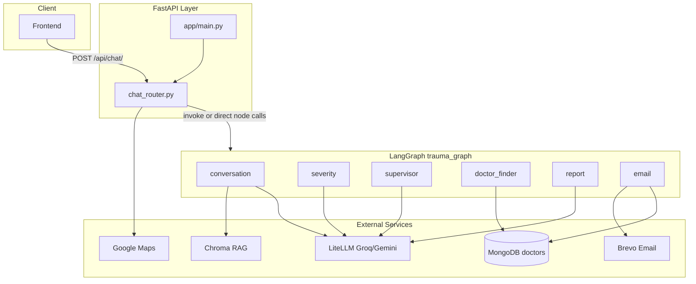
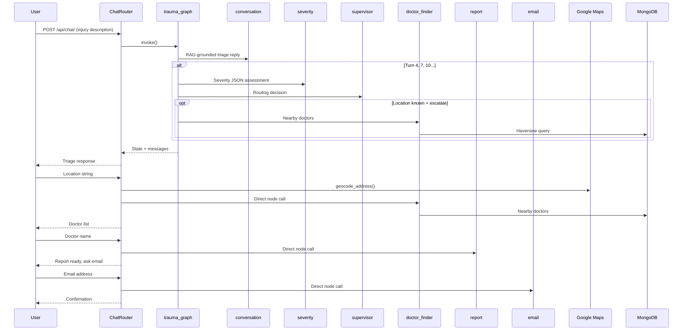
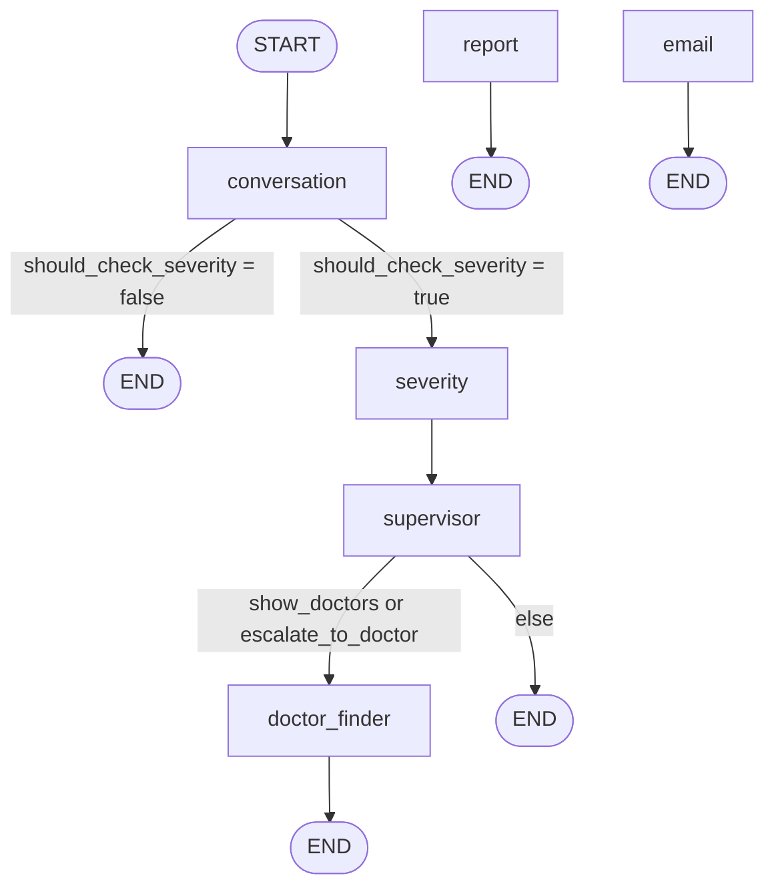

# Anovaidya Backend Analysis Report

**Project:** Anovaidya / TraumaAI — Medical Trauma Assistant  
**Scope:** `backend/` directory  
**Date:** June 2026  
**Version analyzed:** 1.0.0 (FastAPI app)

---

## Table of Contents

1. [Executive Summary](#1-executive-summary)
2. [What Is Built So Far](#2-what-is-built-so-far)
3. [Agents & Nodes Inventory](#3-agents--nodes-inventory)
4. [Implemented vs Planned](#4-implemented-vs-planned)
5. [Quality Assessment & Improvement Areas](#5-quality-assessment--improvement-areas)
6. [Recommended Roadmap](#6-recommended-roadmap)
7. [Tech Stack Summary](#7-tech-stack-summary)
8. [File Index](#8-file-index)

---

## 1. Executive Summary

**Anovaidya** (branded as **TraumaAI** in the API) is a FastAPI backend that powers an AI-driven trauma triage chatbot. It guides users through injury assessment, provides RAG-grounded first-aid advice, scores clinical severity, finds nearby specialists, generates structured reports, and emails them to doctors and patients.

### At a Glance

| Metric | Value |
|--------|-------|
| Python source files | 23 |
| HTTP endpoints | 3 (`GET /`, `GET /health`, `POST /api/chat/`) |
| LangGraph workflows | **1** (`trauma_graph`) |
| Graph nodes (agents) | **6** |
| Conditional routers | 2 |
| Separate Agent classes | 0 |
| Test files | 0 |
| Maturity | Functional MVP — happy path works; production hardening incomplete |

### Core Stack

- **Web:** FastAPI + Uvicorn
- **AI orchestration:** LangGraph with in-memory checkpointing
- **LLM:** LiteLLM routing Groq (primary) and Gemini (fallback)
- **RAG:** ChromaDB + HuggingFace `all-MiniLM-L6-v2` embeddings over PDF manuals
- **Database:** MongoDB (Motor async) — doctors collection only
- **Geocoding:** Google Maps API
- **Email:** Brevo REST API via `httpx`

### Agent Count — Quick Answer

There is **one multi-agent LangGraph workflow** containing **six specialized nodes**. These are not six independent agent runtimes or six separate graph definitions — they are six steps in a single pipeline, with two nodes (`report`, `email`) partially bypassed by manual orchestration in the chat router.

---

## 2. What Is Built So Far

### 2.1 High-Level Architecture



### 2.2 Directory Structure

```text
backend/
├── server.py                 # Dev server launcher (uvicorn)
├── seed_doctors.py           # MongoDB seed script for sample doctors
├── requirements.txt          # Python dependencies
├── .env.example              # Environment variable template
├── BACKEND_ANALYSIS.md       # This report
└── app/
    ├── main.py               # FastAPI app, lifespan, CORS, health routes
    ├── core/
    │   ├── config.py         # pydantic-settings configuration
    │   └── litellm_client.py # Multi-model LLM client with fallback
    ├── db/
    │   └── mongodb.py        # Motor async MongoDB connection
    ├── models/
    │   └── doctors.py        # Pydantic doctor schemas (no user/chat models)
    ├── repo/
    │   └── doctor_repo.py    # Doctor data access + haversine search
    ├── routes/
    │   └── chat_router.py    # Single chat endpoint + phase orchestration
    ├── agents/
    │   ├── state.py          # TraumaGraphState TypedDict
    │   ├── graph.py          # LangGraph workflow definition
    │   └── nodes/            # Six node implementations
    ├── rag/
    │   ├── loader.py         # PDF load and chunk
    │   └── vectorstore.py    # Chroma persistence + retriever
    └── utils/
        ├── prompts.py        # LLM system prompts
        ├── geocoding.py      # Google Maps geocoding
        ├── brevo_email.py    # Brevo email dispatch
        └── sample_doctor.py  # Sample seed data (Chennai area)
```

Runtime-created directories (not in git):

- `knowledge_base/` — PDF first-aid manuals for RAG ingestion
- `chroma_db/` — persisted Chroma vector index

### 2.3 Module Responsibilities

| Layer | Key Files | Role |
|-------|-----------|------|
| Entry | `server.py`, `app/main.py` | Uvicorn launcher; FastAPI app with Mongo lifespan and CORS |
| Config / LLM | `app/core/config.py`, `app/core/litellm_client.py` | Env settings; Groq/Gemini routing with automatic fallback |
| API | `app/routes/chat_router.py` | Chat endpoint; phase-based routing for location, doctor, email |
| Agents | `app/agents/` | LangGraph state, graph wiring, six node implementations |
| RAG | `app/rag/` | PDF loader, Chroma vector store, retriever (top-k=4) |
| Data | `app/db/mongodb.py`, `app/repo/doctor_repo.py` | Async Mongo; nearby doctor search by specialization |
| Utils | `app/utils/` | Prompts, geocoding, email, sample seed data |

### 2.4 API Endpoints

| Method | Path | Handler | Description |
|--------|------|---------|-------------|
| `GET` | `/` | `root()` | Returns app name, status, and environment |
| `GET` | `/health` | `health()` | Liveness probe — `{ "status": "ok" }` |
| `POST` | `/api/chat/` | `chat_endpoint()` | Main trauma conversation endpoint |

#### Chat Request / Response

**Request body (`ChatRequest`):**

| Field | Type | Default | Purpose |
|-------|------|---------|---------|
| `message` | `str` | required | User's chat message |
| `user_id` | `str` | `"test-user"` | User identifier (not authenticated) |
| `session_id` | `str` | `"test-session"` | LangGraph thread ID for state persistence |

**Response body (`ChatResponse`):**

| Field | Type | Purpose |
|-------|------|---------|
| `response` | `str` | Assistant reply text |
| `severity_score` | `int \| null` | Latest severity score (1–5) |
| `doctors_recommended` | `list[dict]` | Nearby doctor results |
| `report_ready` | `bool` | Whether a clinical report has been generated |
| `next_action` | `str` | Frontend phase hint (see below) |

**`next_action` values returned to the client:**

| Value | Meaning |
|-------|---------|
| `continue` / `continue_conversation` | Keep chatting |
| `ask_location` | Waiting for user location |
| `select_doctor` | Waiting for doctor selection |
| `ask_email` | Waiting for user email |
| `complete` | Flow finished |

OpenAPI documentation is auto-generated at `/docs` when the server is running.

### 2.5 End-to-End User Flow



**Step-by-step:**

1. User describes injury → **conversation** node responds with empathetic, RAG-grounded first-aid guidance.
2. At turns 4, 7, 10, … → **severity** scores 1–5 → **supervisor** decides next step.
3. If escalation needed → supervisor sets `ask_location` → user sends address → router geocodes → **doctor_finder** runs.
4. User picks a doctor by name → **report** node generates a clinical summary.
5. User provides email → **email** node sends report to doctor and user via Brevo.

Session state persists via LangGraph's `MemorySaver` checkpointer, keyed by `session_id`.

### 2.6 State Management

All nodes share a single `TraumaGraphState` TypedDict defined in `app/agents/state.py`:

| Field Group | Fields |
|-------------|--------|
| Conversation | `messages` (with `add_messages` reducer), `turn_count` |
| Session | `user_id`, `session_id` |
| Severity | `severity_score`, `severity_reason`, `needs_doctor`, `specialization_needed` |
| Routing | `next_action`, `should_check_severity` |
| Location | `user_location_string`, `latitude`, `longitude` |
| Doctors | `doctor_recommendation`, `selected_doctor_name` |
| Report / Email | `final_summary`, `report_sent`, `user_email`, `email_sent_success` |

---

## 3. Agents & Nodes Inventory

### 3.1 Count Summary

| Category | Count | Notes |
|----------|------:|-------|
| LangGraph workflows | 1 | `trauma_graph` in `app/agents/graph.py` |
| Graph nodes | **6** | See table below |
| Conditional edge functions | 2 | `should_check_severity`, `route_after_supervisor` |
| OOP Agent classes | 0 | Nodes are plain functions |
| LLM-powered nodes | 4 | conversation, severity, supervisor, report |
| Tool/integration nodes | 2 | doctor_finder (Mongo), email (Brevo) |

### 3.2 Node Reference

| # | Node | File | LLM Model | Purpose |
|---|------|------|-----------|---------|
| 1 | **conversation** | `app/agents/nodes/conversation_node.py` | fast (Groq Llama 3.1 8B) | Empathetic trauma triage chat grounded in RAG first-aid knowledge |
| 2 | **severity** | `app/agents/nodes/severity_node.py` | strong (Groq Llama 3.3 70B) | JSON severity score 1–5, `needs_doctor`, medical specialization |
| 3 | **supervisor** | `app/agents/nodes/supervisor_node.py` | strong | Routes flow: continue, ask location, show doctors, escalate |
| 4 | **doctor_finder** | `app/agents/nodes/doctor_finder_node.py` | None | Finds nearby specialized doctors from MongoDB (4 km radius) |
| 5 | **report** | `app/agents/nodes/report_node.py` | strong | Generates structured clinical trauma report for selected doctor |
| 6 | **email** | `app/agents/nodes/email_node.py` | None | Sends report to doctor and user via Brevo |

### 3.3 Detailed Node Breakdown

#### 1. conversation

**Purpose:** Primary user-facing triage dialogue. Retrieves relevant first-aid chunks from Chroma and crafts turn-aware responses.

**Inputs:** `messages`, `turn_count`

**Outputs:**
- New `AIMessage` with triage reply
- `turn_count` incremented
- `should_check_severity` set to `true` at turns 4, 7, 10, …

**External integrations:** Chroma RAG retriever (`k=4`, 600-char chunk truncation)

**Turn guidance baked into prompt:**
- Turn 0: Warm acknowledgment, ask what happened
- Turn 1: Ask about pain severity, bleeding, swelling
- Turn 2: Ask about timing and worsening symptoms
- Turn 3+: Summarize injury and give actionable first-aid tips

---

#### 2. severity

**Purpose:** Clinical assessment of injury severity and required medical specialization.

**Inputs:** Last ~10 messages from conversation history

**Outputs:**
- `severity_score` (1–5 integer)
- `severity_reason` (text)
- `needs_doctor` (boolean)
- `specialization_needed` (string, e.g. "Orthopedic Surgeon")
- Internal `[Severity Assessment: …]` AIMessage appended to history

**Prompt:** `SEVERITY_SYSTEM_PROMPT` — expects JSON-only response

**Fallback:** On parse failure, defaults to score 2, no doctor needed, General Physician

---

#### 3. supervisor

**Purpose:** Intelligent router that decides what happens after severity assessment.

**Inputs:** `messages`, `severity_score`, `latitude`, `specialization_needed`

**Outputs:**
- `next_action` — one of: `continue_conversation`, `ask_location`, `show_doctors`, `escalate_to_doctor`
- User-facing `AIMessage` explaining the decision

**Logic overrides:**
- If location is already known and action is `ask_location` or `escalate_to_doctor` → forces `show_doctors`

**Fallback (on JSON parse error):**
- Severity ≥ 4, no location → `escalate_to_doctor`
- Severity ≥ 3, no location → `ask_location`
- Otherwise → `continue_conversation`

---

#### 4. doctor_finder

**Purpose:** Query MongoDB for nearby doctors matching the required specialization.

**Inputs:** `latitude`, `longitude`, `specialization_needed`, `severity_score`, `user_location_string`

**Outputs:**
- `doctor_recommendation` (list of doctor dicts with distance)
- `next_action: "select_doctor"`
- Formatted doctor list `AIMessage`

**Defaults:** Falls back to Chennai center `(13.0827, 80.2707)` if coordinates missing

**Query params:** 4 km radius, min 5 / max 10 results, filtered by specialization

**Note:** Implemented as `async def` — invoked with `await` in router, but may not run correctly when reached via sync `graph.invoke()`.

---

#### 5. report

**Purpose:** Generate a clinical-grade trauma report summarizing the conversation for the selected doctor.

**Inputs:** `messages`, `severity_score`, `specialization_needed`, `selected_doctor_name`

**Outputs:**
- `final_summary` (full report text)
- `next_action: "ask_email"`
- Prompt asking user to share email

**Prompt:** `REPORT_PROMPT` (note: `REPORT_SYSTEM_PROMPT` exists but is unused)

**Execution:** Called directly by `chat_router.py` — **not wired into graph edges**.

---

#### 6. email

**Purpose:** Dispatch the clinical report to both the selected doctor and the user.

**Inputs:** `user_email`, `selected_doctor_name`, `final_summary`, `severity_score`

**Outputs:**
- `email_sent_success`, `report_sent` (booleans)
- Confirmation or error `AIMessage`

**External integrations:** `doctor_repo.get_doctor_by_name()`, `send_report_via_brevo()`

**Execution:** Called directly by `chat_router.py` — **not wired into graph edges**.

### 3.4 Graph Wiring



**Compiled graph path:**

```text
START → conversation → [severity?] → supervisor → [doctor_finder?] → END
```

**Orphan nodes:** `report` and `email` are registered in the graph but have **no incoming edges**. They only execute when `chat_router.py` calls them directly and updates state via `trauma_graph.update_state()`.

This split orchestration is the most significant architectural characteristic of the current codebase.

### 3.5 LLM Configuration

Defined in `app/core/litellm_client.py`:

| Alias | Model | Used By |
|-------|-------|---------|
| `fast` | `groq/llama-3.1-8b-instant` | conversation |
| `strong` | `groq/llama-3.3-70b-versatile` | severity, supervisor, report |
| `gemini` (fallback) | `gemini/gemini-3.5-flash` | Auto-fallback on Groq errors |

Fallback chain: fast → gemini → strong (on repeated failure).

No LangChain tool-calling or function-calling is used. External capabilities (RAG, geocoding, Mongo, Brevo) are hard-coded service calls inside nodes or the router.

### 3.6 Prompts

All prompts live in `app/utils/prompts.py`:

| Constant | Used By | Format |
|----------|---------|--------|
| `TRAUMA_SYSTEM_PROMPT` | conversation | System + turn guidance + RAG context |
| `SEVERITY_SYSTEM_PROMPT` | severity | JSON: score, reason, needs_doctor, specialization |
| `SUPERVISOR_PROMPT` | supervisor | JSON: next, user_message, reason |
| `REPORT_PROMPT` | report | Structured clinical report |
| `REPORT_SYSTEM_PROMPT` | **Unused** | Dead code |

---

## 4. Implemented vs Planned

Comparison against the project specification in the root `Readme.md`:

| Feature | Status | Notes |
|---------|--------|-------|
| Trauma chat with empathy | ✅ Implemented | conversation node |
| RAG first-aid guidance | ✅ Implemented | Chroma + PDF loader |
| Severity assessment (1–5) | ✅ Implemented | severity node, turn-based triggers |
| Supervisor routing | ✅ Implemented | supervisor node |
| Nearby doctor finder | ✅ Implemented | doctor_finder + haversine Mongo query |
| Google Maps geocoding | ✅ Implemented | Called from chat router |
| Clinical report generation | ✅ Implemented | report node (router-bypass) |
| Email dispatch (Brevo) | ✅ Implemented | email node (router-bypass) |
| Multi-LLM failover | ✅ Implemented | LiteLLM Groq → Gemini fallback |
| JWT auth + user accounts | ❌ Not implemented | Dependencies declared, no code |
| Chat history in MongoDB | ❌ Not implemented | In-memory checkpointer only |
| Redis sessions/caching | ❌ Not implemented | `REDIS_URL` required in config, unused |
| Services layer | ❌ Not implemented | Logic in routes + nodes |
| Doctor registration API | ❌ Partial | Pydantic models exist, no routes |
| Streaming chat | ❌ Not implemented | Synchronous invoke only |
| Unit / integration tests | ❌ Not implemented | pytest in requirements, zero test files |
| CI/CD pipeline | ❌ Not implemented | No GitHub Actions workflows |
| Docker | ❌ Not implemented | No Dockerfile |
| Backend README | ❌ Not implemented | Only root project spec |

---

## 5. Quality Assessment & Improvement Areas

Issues are grouped by priority. Each includes the impact and a suggested fix direction.

### 5.1 Critical — Correctness & Architecture

#### 1. Dual Orchestration (Graph + Router)

**Problem:** The LangGraph handles triage (conversation → severity → supervisor → doctor_finder), but `chat_router.py` manually invokes `doctor_finder_node`, `report_node`, and `email_node` outside the graph using `update_state()` + direct function calls.

**Impact:** Hard to test as a single workflow; state transitions are split across two layers; graph diagram misrepresents actual execution paths.

**Fix:** Either wire all phases into the graph with conditional entry points, or extract a `ChatService` that owns the full state machine and simplify the graph to pure triage.

---

#### 2. Dead Graph Nodes (report, email)

**Problem:** `report` and `email` are registered in `graph.py` with edges to `END` but no incoming edges. They never execute via `trauma_graph.invoke()`.

**Impact:** Misleading for developers reading the graph; report/email logic is invisible in graph visualization tools (LangSmith, etc.).

**Fix:** Add supervisor/router edges to reach these nodes, or remove them from the graph and document them as router-managed steps.

---

#### 3. Async/Sync Mismatch

**Problem:** `doctor_finder_node` and `email_node` are `async def`, but the default chat path uses sync `trauma_graph.invoke()`. When supervisor routes to `doctor_finder` inside the graph, the async node may not execute correctly.

**Impact:** Doctor finder may silently fail or behave incorrectly on the graph path (severity turn with known location), while the router path (with `await`) works fine.

**Fix:** Switch to `await trauma_graph.ainvoke()` everywhere, or refactor async nodes to sync wrappers.

---

#### 4. Conversation Message Roles Bug

**Problem:** In `conversation_node.py`, all messages — including the system prompt and prior assistant replies — are sent to the LLM as `role: "user"`:

```python
response = llm_client.call(
    messages=[{"role": "user", "content": msg.content} for msg in full_messages],
    model="fast",
    temperature=0.7
)
```

**Impact:** The model loses assistant/user turn distinction, which degrades multi-turn coherence and can cause the model to "talk to itself."

**Fix:** Map `SystemMessage` → `system`, `HumanMessage` → `user`, `AIMessage` → `assistant`.

---

#### 5. `needs_doctor` Field Ignored

**Problem:** The severity node computes and stores `needs_doctor` in state, but the supervisor node never reads it — routing relies solely on `severity_score`.

**Impact:** LLM's explicit clinical judgment about doctor necessity is discarded; severity score alone drives escalation.

**Fix:** Pass `needs_doctor` into the supervisor prompt and fallback logic.

---

### 5.2 High — Reliability & Production Readiness

#### 6. No Automated Tests

**Problem:** `pytest` and `pytest-asyncio` are in `requirements.txt` but there are zero test files, no `tests/` directory, and no `conftest.py`.

**Impact:** No regression safety net; refactoring the dual orchestration is risky.

**Fix:** Start with unit tests for node functions (mock LLM), integration tests for `chat_router` phase transitions, and a fixture for graph state.

---

#### 7. In-Memory Session Checkpointing

**Problem:** LangGraph uses `MemorySaver` — all session state is lost on server restart.

**Impact:** Users mid-conversation lose context; not viable for production.

**Fix:** Switch to a persistent checkpointer (Redis, MongoDB, or Postgres via LangGraph's built-in savers).

---

#### 8. CORS Wide Open

**Problem:** `app/main.py` sets `allow_origins=["*"]` with `allow_credentials=True`.

**Impact:** Security misconfiguration; browsers may reject this combination, or it allows any origin with credentials in some configurations.

**Fix:** Restrict to known frontend origins in production; set credentials appropriately.

---

#### 9. No Authentication

**Problem:** `user_id` is a free-form string defaulting to `"test-user"`. No JWT, no session validation.

**Impact:** Anyone can impersonate any user; no access control on chat sessions.

**Fix:** Implement auth as planned in the root README (`security.py`, `auth.py` routes).

---

#### 10. Required but Unused Dependencies

**Problem:** Several packages are declared in `requirements.txt` and/or required in config but have no implementation:

| Package / Config | Status |
|------------------|--------|
| `redis` / `REDIS_URL` | Required in config, no client code |
| `python-jose`, `passlib`, `bcrypt` | No auth code |
| `brevo-python` | Email uses raw `httpx` |
| `langchain-groq`, `langchain-google-genai` | LLM goes through LiteLLM |
| `geopy` | Geocoding uses `googlemaps` |
| `pytz`, `python-multipart`, `email-validator` | Not referenced |

**Impact:** Bloated install, confusing onboarding, false sense of implemented features.

**Fix:** Remove unused deps or implement the features they were added for.

---

#### 11. `DB_NAME` Missing from `.env.example`

**Problem:** `app/core/config.py` requires `DB_NAME`, but `.env.example` does not document it.

**Impact:** New developers get startup errors until they discover the missing variable.

**Fix:** Add `DB_NAME=trauma_ai` (or appropriate name) to `.env.example`.

---

### 5.3 Medium — UX & Maintainability

#### 12. Severity Turns Hide Conversation Reply

**Problem:** On severity assessment turns, the graph runs conversation → severity → supervisor, adding multiple AIMessages. `_extract_last_ai_message()` returns the supervisor's routing message, not the triage reply from conversation.

**Impact:** User may not see the first-aid advice generated on that turn.

**Fix:** Return both messages, concatenate them, or restructure so conversation reply is always the primary response.

---

#### 13. `next_action` Vocabulary Inconsistency

**Problem:** State default is `"continue"`; supervisor sets `"continue_conversation"`; state comment lists `"send_report"` which is never used; `REPORT_SYSTEM_PROMPT` is defined but never imported.

**Impact:** Frontend must handle multiple values for the same semantic state; dead code accumulates.

**Fix:** Normalize to a single enum or constants module shared by graph, router, and API response.

---

#### 14. Silent Chennai Location Fallback

**Problem:** `doctor_finder_node` defaults to `(13.0827, 80.2707)` (Chennai center) when lat/lon are missing.

**Impact:** Users outside Chennai may receive irrelevant doctor recommendations without warning.

**Fix:** Require explicit coordinates; return an error message if location is unknown.

---

#### 15. No Workflow-Level Error Handling

**Problem:** Individual nodes have JSON parse fallbacks, but there is no graph-level retry, circuit breaker, or graceful degradation strategy.

**Impact:** Unhandled exceptions bubble to HTTP 500 with raw error strings.

**Fix:** Add middleware or graph error nodes; return user-friendly error responses.

---

#### 16. Informal Package Structure

**Problem:** No `__init__.py` files in `app/` or subpackages. Imports work via absolute paths when cwd is `backend/`, but tooling and IDE support may be inconsistent.

**Fix:** Add `__init__.py` files; consider `pyproject.toml` for proper package definition.

---

#### 17. Side Effect on Import

**Problem:** `graph.py` line 73 executes `print("[GRAPH] TraumaAI graph compiled successfully.")` at module import time.

**Impact:** Noise in logs/tests; graph compiles on every import including test collection.

**Fix:** Move to startup logging in the FastAPI lifespan handler.

---

### 5.4 Low — Polish

| # | Issue | Notes |
|---|-------|-------|
| 18 | No backend README | Onboarding relies on root spec + this report |
| 19 | No CI/CD | No automated lint, test, or deploy pipeline |
| 20 | RAG may be empty | `knowledge_base/` folder may have no PDFs until manually added |
| 21 | No API versioning | All routes at root level; no `/v1/` prefix |
| 22 | No rate limiting | Chat endpoint unprotected against abuse |
| 23 | Print-based logging | Nodes use `print()` instead of structured `logging` |

---

## 6. Recommended Roadmap

### Phase 1 — Stability (1–2 weeks)

Focus on correctness bugs and basic test coverage.

- [ ] Fix conversation message role mapping (system/user/assistant)
- [ ] Unify async orchestration (`ainvoke` or sync wrappers)
- [ ] Add `DB_NAME` to `.env.example`
- [ ] Write pytest tests for nodes (mock LLM) and chat router phase transitions
- [ ] Replace `print()` with `logging` in nodes and graph

### Phase 2 — Architecture (2–3 weeks)

Consolidate the split orchestration into a maintainable design.

- [ ] Wire `report` and `email` into the graph OR extract a `ChatService`
- [ ] Normalize `next_action` to a shared enum
- [ ] Use `needs_doctor` in supervisor routing
- [ ] Remove unused `REPORT_SYSTEM_PROMPT` or wire it up
- [ ] Add `__init__.py` files and optional `pyproject.toml`

### Phase 3 — Production Readiness (3–4 weeks)

Features needed before real users.

- [ ] Persistent checkpointer (Redis or MongoDB)
- [ ] JWT authentication + user model
- [ ] Chat history persistence in MongoDB
- [ ] Tighten CORS to known origins
- [ ] Remove unused dependencies from `requirements.txt`
- [ ] Structured error responses (no raw exception strings to client)

### Phase 4 — Scale & Features (ongoing)

- [ ] Streaming chat endpoint (SSE or WebSocket)
- [ ] Doctor registration/list HTTP APIs
- [ ] LangSmith tracing verification in production
- [ ] CI/CD pipeline (lint + test + deploy)
- [ ] Docker containerization
- [ ] API versioning (`/api/v1/`)
- [ ] Rate limiting on chat endpoint

---

---

## 8. File Index

Complete reference of all 23 Python source files in the backend.

| File | Description |
|------|-------------|
| `server.py` | Uvicorn dev server entry point |
| `seed_doctors.py` | CLI script to seed MongoDB with sample doctors |
| `app/main.py` | FastAPI application factory, lifespan, CORS, health routes |
| `app/core/config.py` | pydantic-settings configuration loader |
| `app/core/litellm_client.py` | Multi-model LLM client with Groq/Gemini fallback |
| `app/db/mongodb.py` | Motor async MongoDB connection manager |
| `app/models/doctors.py` | Pydantic schemas for doctor entities |
| `app/repo/doctor_repo.py` | Doctor CRUD + haversine nearby search |
| `app/routes/chat_router.py` | Chat API endpoint + phase orchestration |
| `app/agents/state.py` | `TraumaGraphState` TypedDict definition |
| `app/agents/graph.py` | LangGraph workflow, edges, compile |
| `app/agents/nodes/conversation_node.py` | RAG-grounded triage conversation |
| `app/agents/nodes/severity_node.py` | Clinical severity assessment |
| `app/agents/nodes/supervisor_node.py` | Post-severity routing decisions |
| `app/agents/nodes/doctor_finder_node.py` | Nearby doctor search |
| `app/agents/nodes/report_node.py` | Clinical report generation |
| `app/agents/nodes/email_node.py` | Brevo email dispatch |
| `app/rag/loader.py` | PDF document loader and text splitter |
| `app/rag/vectorstore.py` | ChromaDB initialization and retriever |
| `app/utils/prompts.py` | LLM system prompts for all nodes |
| `app/utils/geocoding.py` | Google Maps address geocoding |
| `app/utils/brevo_email.py` | Brevo transactional email sender |
| `app/utils/sample_doctor.py` | Sample doctor data for seeding |

---

## Appendix: Key Architectural Insight

The backend successfully delivers the core trauma triage MVP — a user can chat, get first-aid advice, be severity-scored, find nearby doctors, receive a report, and have it emailed. The implementation is pragmatic and functional.

The primary technical debt is **orchestration fragmentation**: half the workflow lives in LangGraph, half in imperative router code. Consolidating this into a single, testable state machine should be the top architectural priority before adding auth, persistence, or scaling features.

---

*Report generated from static analysis of the backend codebase. No secrets or environment values are included.*
