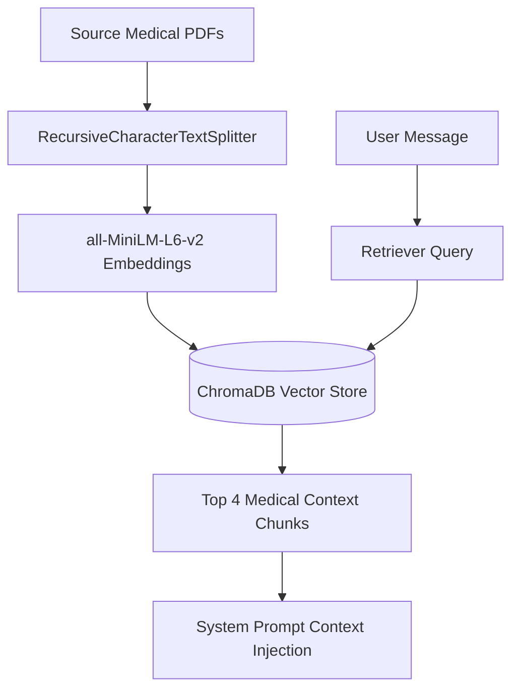
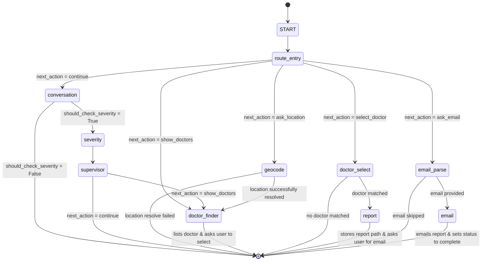

# Anovaidya - Backend Architecture & Feature Documentation

This document provides a comprehensive overview of the backend features, AI models, Retrieval-Augmented Generation (RAG) implementation, and agentic workflows built for **Anovaidya - Medical Trauma Assistant**.

---

## 🛠️ 1. Core Backend Features & Working States

The Anovaidya backend is developed using **FastAPI** as the API gateway, **LangGraph** for multi-agent cyclic state management, and **MongoDB** & **ChromaDB** as the storage layers. Below is the status of the key backend features:

| Feature | Description | Implementation Utility | Working State |
| :--- | :--- | :--- | :--- |
| **Conversational Triage** | Compassionate first-aid guidance grounded in medical PDFs. | LangGraph + ChromaDB + Groq | **Operational** |
| **Severity Assessment** | Evaluates conversation history and outputs a clinical score (1-5). | Groq Llama 3.3 (70B) | **Operational** |
| **Supervisor Orchestrator** | Coordinates transitions (continue chat, ask location, show docs). | LangGraph Router | **Operational** |
| **Google Geocoding API** | Translates user address string into lat/lng coordinates. | Google Maps Geocoding API | **Operational** |
| **Nearby Specialist Finder** | 3-Phase Concentric Search for hospitals/clinics/specialists. | Google Maps Places API | **Operational** |
| **Report Generation (.docx)** | Formats a structured clinical report in a native Word document. | Gemini 3.5 Flash + `python-docx` | **Operational** |
| **Transactional Email** | Encodes `.docx` in Base64 and emails report via Brevo. | Brevo SMTP REST API | **Operational** |
| **JWT Authentication** | Secures sign-up, sign-in, and persistent session histories. | PyJWT + PassLib | **Planned / Future Enhancement** |

---

## 🤖 2. Our AI Model & Routing Strategy

We utilize a hybrid multi-model architecture configured through **LiteLLM** to balance response speed, clinical reasoning accuracy, and cost-efficiency.

### Multi-LLM Setup
1. **Primary Conversational Model (`groq/llama-3.1-8b-instant`)**
   - **Role:** Handles basic chat turns, asks diagnostic questions, and provides empathetic replies.
   - **Why:** Instant response speed (essential in emergency situations) and extremely low token costs.
2. **Clinical Reasoning Model (`groq/llama-3.3-70b-versatile`)**
   - **Role:** Assesses patient injury severity and coordinates supervisor state transitions.
   - **Why:** Highly capable model that consistently adheres to complex instructions and structured JSON schemas.
3. **Report Generation & Fallback Model (`gemini/gemini-3.5-flash`)**
   - **Role:** Summarizes trauma dialogue and compiles comprehensive medical reports. Also acts as the global LLM fallback.
   - **Why:** Strong clinical synthesis and large context window, ideal for detailing symptoms, first-aid, and recommended doctor actions.

### Failover Resiliency
The `LiteLLMClient` is equipped with automatic failover routing:
- If a Groq API request fails (due to rate limits or outage), the client catches the exception and routes the query to **Gemini 3.5 Flash**.
- If Gemini fails, the system retries using the alternative Groq Llama 3.3 70b model, assuring uninterrupted service.

---

## 📚 3. RAG (Retrieval-Augmented Generation) Implementation

To ensure that the assistant provides verified first-aid guidance and avoids clinical hallucinations, we implement a Retrieval-Augmented Generation engine.

### Technical Details
- **Knowledge Base:** Reads source medical and first-aid PDFs from the `backend/knowledge_base/` folder.
- **Document Chunker:** Uses LangChain's `RecursiveCharacterTextSplitter` configured with a `chunk_size` of **800 characters** and a `chunk_overlap` of **150 characters** (using separators `["\n\n", "\n", ".", " "]`) to maintain semantic unity.
- **Embedding Model:** Uses `sentence-transformers/all-MiniLM-L6-v2` run locally. It is free and highly resource-light.
- **Vector Database:** Local `ChromaDB` stored in `backend/chroma_db/`.
- **Query-Time Retrieval:** Retrieves the top **`k=4`** most similar chunks matching the user's last message and injects them as grounding context into the system prompt.

---

## 🔄 4. Graph Workflow & Agentic AI Design

Anovaidya utilizes **LangGraph** to model the medical triage as a stateful, cyclic workflow. The graph state (`TraumaGraphState`) contains conversation messages, triage metrics, geocoding details, recommended doctor listings, and generated report links.

### Detailed Agent / Node Description

#### 1. `conversation` Node
- **Function:** Converses with the user during triage.
- **Behavior:** Combines the system prompt, retrieved medical manuals (RAG context), and turn-based diagnostic guidance (Turn 1: Warm welcome; Turn 2: Symptom gathering; Turn 3: History gathering; Turn 4+: Summary & RAG first-aid advice).

#### 2. `severity` Node
- **Function:** Formulates a clinical score on a scale of 1 to 5.
- **Trigger:** Triggers at Turn 4 and runs every 3 turns thereafter to assess symptoms dynamically.
- **Output:** Returns a structured JSON schema outlining `severity_score`, `reason`, `needs_doctor` (boolean), and `specialization_needed`.

#### 3. `supervisor` Node
- **Function:** Decides if the patient needs to be escalated or if first-aid conversation should continue.
- **Behavior:** Reviews the severity, clinical need flags, and current geocoding coordinates.
  - If `severity >= 3` and no location is stored, updates `next_action` to `"ask_location"`.
  - If `severity >= 4` and no location is stored, updates `next_action` to `"escalate_to_doctor"`.
  - If a location is resolved, moves the user to `"show_doctors"`.

#### 4. `geocode` Node
- **Function:** Converts human-written addresses into GPS coordinates.
- **Behavior:** Queries Google Maps Geocoding API. If successful, updates the state's `latitude`, `longitude`, and normalized `user_location_string`.

#### 5. `doctor_finder` Node
- **Function:** Locates nearby hospitals, clinics, and matching specialists.
- **Behavior:** Triggers a **3-Phase Concentric Fallback Search** via Google Maps Places API:
  - **Phase 1:** Searches for target specialized facilities within **5 km**.
  - **Phase 2:** Expands the radius to **15 km** if fewer than 3 specialized facilities are found.
  - **Phase 3:** Triggers a general fallback search for `"hospital emergency"` within **15 km** if specialist searches yield no results.
- **Output:** Returns normalized facility records with name, distance (Haversine formula), status (Open Now/Closed), and rating stats.

#### 6. `doctor_select` Node
- **Function:** Parses the selected doctor name from the user's message and links it to the session data.

#### 7. `report` Node
- **Function:** Compiles a comprehensive clinical report and exports it to a `.docx` file.
- **Behavior:** Feeds the conversation history to Gemini 3.5 Flash under `REPORT_PROMPT` guidelines. Parses the resulting markdown, populates a styled Word template using `python-docx` (featuring bold headings, structured spacing, and a metadata summary grid), and returns a relative download URL (`/api/reports/{session}/download`).

#### 8. `email_parse` Node
- **Function:** Captures the user's email address or handles the "skip" command gracefully.

#### 9. `email` Node
- **Function:** Dispatches the trauma summary report.
- **Behavior:** Calls the Brevo Transactional Email API. Encodes the generated `.docx` file in Base64 and attaches it to the email sent directly to the patient's inbox.

---

## 📝 5. System Prompts & Guardrails

We have codified strict guardrails and behavioral constraints across our system prompts (defined in `app/utils/prompts.py`):

1. **`TRAUMA_SYSTEM_PROMPT` (Conversation)**
   - Speak in simple, clear, reassuring language; avoid overwhelming medical jargon.
   - Ask **one** focused question at a time to prevent panicking distressed users.
   - Limit responses to 2–4 short sentences.
   - NEVER provide diagnostic conclusions or suggest specific medication dosages.
2. **`SEVERITY_SYSTEM_PROMPT` (Clinical Grading)**
   - Maps patient injuries to a strict 1 (Very Minor) to 5 (Life-Threatening) scale.
   - Maps symptoms directly to specialized clinical departments (`Orthopedics`, `Neurology`, `General Surgery`, `Trauma Surgeon`, `Emergency Medicine`).
3. **`SUPERVISOR_PROMPT` (Routing Orchestrator)**
   - Evaluates escalation necessity based on numerical thresholds.
   - NEVER mentions the words "severity score" or numerical values directly to the user; instead, translates metrics into natural reassuring language (e.g., "this seems to be minor", "this needs professional care").
4. **`REPORT_PROMPT` (Clinical Report Summary)**
   - Standardizes the summary sent to the doctor: chief complaint, history of present illness, key symptoms reported, first-aid provided, severity assessment reasoning, and recommended action.

---

## 🏁 6. Conclusion

The **Anovaidya Backend** represents a robust, production-grade architecture that leverages state-of-the-art agentic cycles and RAG frameworks.

- **Resiliency:** LiteLLM client guarantees fallbacks across providers (Groq and Google Gemini) ensuring that API outages do not impact a critical trauma assistant.
- **User Safety:** Prompt guidelines enforce strict medical boundaries (no dosing, no final diagnosis, cyclic severity tracking).
- **Extensibility:** Decentralized MongoDB checkpoint savers and ChromaDB vector repos make swapping data providers trivial.
- **Clinical Integration:** The system seamlessly merges real-time Google Maps data, native editable Word documentation generation, and base64-encoded email dispatches via Brevo, offering patients a concrete path toward emergency care.
