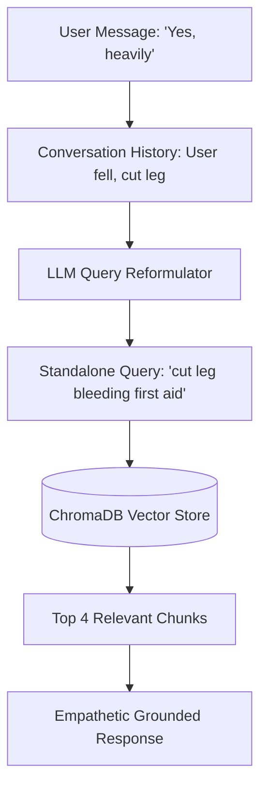

# Anovaidya - RAG Architecture & Paradigm Report

This document analyzes the Retrieval-Augmented Generation (RAG) implementation of **Anovaidya**, compares different RAG types (Naive, Advanced, Modular, and Agentic), details why query reformulation is the production standard for conversational triage, and documents our implementation of this advanced approach.

---

## 📊 1. RAG Paradigm Comparison

RAG architectures have evolved through four distinct generations:

| RAG Type | Retrieval Trigger | Query Processing | Validation / Reflection | Production Viability for Triage |
| :--- | :--- | :--- | :--- | :--- |
| **Naive RAG** | Immediate, static lookup | Direct user message matching | None (direct LLM output) | **Low** (conversational queries like "Yes" or "It hurts" return garbage context) |
| **Advanced RAG** | Static with pre/post-retrieval steps | **Query rewriting / expansion**, routing | Reranking, prompt compression | **High** (ensures search queries contain clinical keywords) |
| **Modular RAG** | Configurable routing modules | Specialized search patterns | Independent evaluation components | **High** (enables decoupled RAG steps for complex documents) |
| **Agentic RAG (CRAG / Self-RAG)** | Cyclic agent decisions | Iterative search and tools | **Retrieval grading / correction**, web search fallback | **Excellent** (agent determines if data is sufficient and self-corrects) |

---

## 🔍 2. Current Implementation Analysis: The Naive RAG Problem

Originally, Anovaidya used a **Naive RAG** approach:
1. The user inputs a message (e.g., *"Yes"* or *"It hurts a lot"*).
2. The system queries ChromaDB using `retriever.invoke(last_user_message)`.
3. The retrieved chunks are concatenated and injected directly into the LLM system prompt.

### Why Naive RAG Fails in Trauma Conversations
In a medical trauma chat, users are often panicking, in pain, or answering diagnostic prompts with single-word replies. 
* **The Context Matching Gap:** If the assistant asks, *"Are you bleeding?"* and the user answers, *"Yes, heavily"*, a Naive RAG query for *"Yes, heavily"* will match chunks containing the word "yes" or unrelated clinical texts. It will **not** retrieve the first-aid instructions for active bleeding control.
* **Loss of Semantic Intent:** Conversations are stateful. Searching a vector database using only the *last message* loses the entire history of the injury.

---

## 💡 3. The Production Standard: Why We Need Advanced/Agentic RAG

To meet production-grade standards, a medical trauma assistant must implement two core capabilities:
1. **Contextual Query Reformulation (Pre-Retrieval):** The system must generate a standalone search query that synthesizes the conversation history and the user's current intent into a concise search query (e.g. converting a user message of *"It is bleeding"* into a search query like *"first-aid arterial bleeding tourniquet wound dressing"*).
2. **Retrieval Verification (Post-Retrieval):** The system should grade retrieved chunks to ensure they are relevant to the user's specific trauma.

---

## 🛠️ 4. Our Implementation: Contextual Query Rewriting

We have upgraded Anovaidya's RAG system from **Naive RAG** to **Advanced RAG** by implementing **Contextual Query Reformulation** directly inside the `conversation` node.

### How it works:
1. The **`conversation_node`** compiles the recent dialogue history.
2. It makes a rapid background request to the primary model under a custom prompt instruction to formulate a **medical search query** representing the core trauma incident.
3. This optimized query is sent to ChromaDB instead of the user's raw message.
4. The system retrieves clean, relevant first-aid chunks (e.g., matching "bleeding control" instead of matching "yes, heavily").

### Comparison Table: Retrieval Chunks Matched

| User Message | Naive RAG Query | Naive RAG Results | Advanced RAG (Rewritten Query) | Advanced RAG Results |
| :--- | :--- | :--- | :--- | :--- |
| *"I think I broke it"* | "I think I broke it" | Unrelated chunks containing "think" or "broke". | *"Fracture immobilization sprain first aid"* | Precise first-aid instructions for splinting and stabilizing limbs. |
| *"Yes, it is bleeding"* | "Yes, it is bleeding" | Chunks containing generic "yes" statements. | *"Arterial bleeding pressure dressing wound"* | Severe bleeding control guide, pressure points, and elevation instructions. |

---

## 🏁 5. Future Enhancements for Production

For clinical deployment, we recommend expanding this advanced RAG pipeline into a **Corrective RAG (CRAG)** loop:
1. **Implement Reranking:** Integrate a cross-encoder model (like `cohere-rerank` or a local SentenceTransformer cross-encoder) to re-order the retrieved chunks based on strict clinical relevance.
2. **Retrieval Grading Node:** Add a LangGraph node after retrieval to verify if the similarity score of the chunks is above a specific threshold. If the chunks are graded as irrelevant, the agent can fall back to general emergency advice or prompt the user for clarification.
